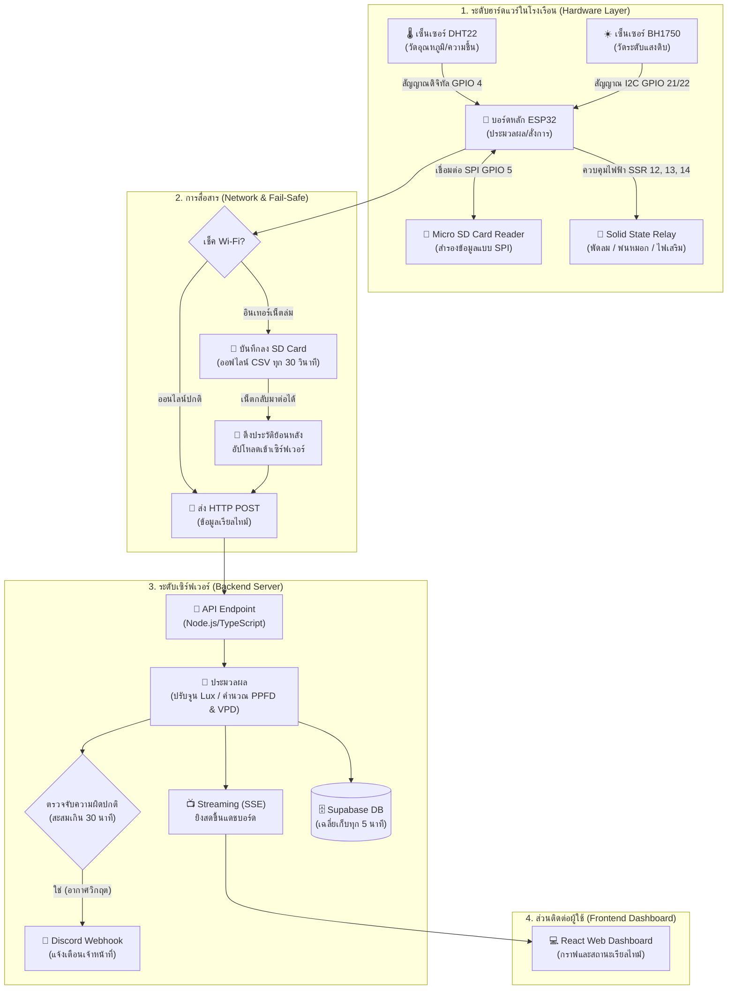

# หลักการทำงานของระบบโรงเรือนอัจฉริยะ (Greenhouse Smart IoT System Working Principle)

เอกสารฉบับนี้อธิบายหลักการทำงานและสถาปัตยกรรมของระบบควบคุมสภาพแวดล้อมในโรงเรือนอัจฉริยะ (Pangda Greenhouse) ตั้งแต่ระดับฮาร์ดแวร์ในโรงเรือน การกู้คืนข้อมูลกรณีฉุกเฉิน ไปจนถึงการจัดเก็บข้อมูลและแจ้งเตือนบนระบบคลาวด์

---

## 1. แผนผังการไหลของข้อมูลและสถาปัตยกรรม (System Architecture & Data Flow)

การทำงานร่วมกันระหว่างอุปกรณ์หน้างาน ระบบเครือข่าย และเซิร์ฟเวอร์แสดงผลดังแผนผังด้านล่าง:

---

## 2. ขั้นตอนการประมวลผลในระบบ (Functional Process)

### 2.1 การรับข้อมูลและปรับจูนความถูกต้อง (Data Acquisition & Calibration)
บอร์ดควบคุมหลัก **ESP32** จะทำหน้าที่ตรวจวัดสภาพอากาศทุก ๆ 5 วินาที โดยรับและประมวลผลข้อมูลดังนี้:
1. **อุณหภูมิและความชื้นสัมพัทธ์:** อ่านข้อมูลสัญญาณดิจิทัลจากเซ็นเซอร์ **DHT22** (ต่อเข้าพิน GPIO 4)
2. **การปรับค่าแสงสว่าง (BH1750 Calibration):** เพื่อความแม่นยำสูงสุดเมื่อใช้ภายนอกอาคาร ค่าแสงดิบ (Raw Lux) ที่ได้จากเซ็นเซอร์ **BH1750** จะถูกนำมาปรับแก้ไข (Calibrate) ผ่านโปรแกรมบนบอร์ดด้วยสมการแบ่งย่าน 4 ระดับ เพื่อแก้ปัญหาวัดค่าคลาดเคลื่อนเมื่อแสงจ้าหรือแสงน้อยเกินไป
3. **การประมวลผลค่าชี้วัดพืช:** 
   * **PPFD (Photosynthetic Photon Flux Density):** แปลงค่าแสงสว่างปกติ (Lux) ให้กลายเป็นค่าความเข้มแสงพืชใช้จริง โดยมีสูตรการคำนวณคือ `PPFD = Lux × 0.0299` (หน่วย: $\mu mol/m^2/s$)
   * **VPD (Vapor Pressure Deficit):** นำอุณหภูมิและความชื้นมาคำนวณหาแรงดันความต่างของไอน้ำ เพื่อใช้ระบุระดับความเครียดในการคายน้ำของใบพืช

### 2.2 ระบบสั่งการอุปกรณ์อัตโนมัติ (Automated Relay Control)
บอร์ด ESP32 จะคอยเปรียบเทียบค่าที่วัดได้จริงกับเกณฑ์ขีดจำกัด (Thresholds) ที่ตั้งค่าไว้ หากค่าสภาพแวดล้อมออกนอกช่วงที่กำหนด บอร์ดจะสั่งการจ่ายสัญญาณไฟฟ้าไปที่ **Solid State Relay (SSR)** ทันทีโดยไม่ต้องรอมนุษย์สั่งการ:
* **พัดลมระบายอากาศ/ปั๊มน้ำ (GPIO 12):** เปิดเมื่ออุณหภูมิอากาศสูงเกินเกณฑ์ เพื่อช่วยลดความร้อนสะสม
* **ระบบพ่นหมอกเพิ่มความชื้น (GPIO 13):** เปิดเมื่อระดับความชื้นสัมพัทธ์ในอากาศต่ำกว่าเกณฑ์ เพื่อรักษาระดับความชื้น
* **ไฟช่วยปลูกพืช Grow Light (GPIO 14):** เปิดอัตโนมัติในช่วงเวลาที่กำหนด (เช่น กลางวัน) เมื่อความเข้มแสงแดดธรรมชาติไม่เพียงพอต่อความต้องการของพืช

### 2.3 การทำงานในสถานะเน็ตหลุดและกู้คืน (Fail-Safe & Offline Data Recovery)
เพื่อการทำงานที่ต่อเนื่องและป้องกันข้อมูลสูญหาย:
* **เมื่ออินเทอร์เน็ตล่ม:** บอร์ด ESP32 จะรับรู้สถานะออฟไลน์และทำการเปลี่ยนจากการส่งข้อมูลผ่านเครือข่าย มาเป็นการบันทึกข้อมูลออฟไลน์ลงในไฟล์ `/offline_logs.csv` ของ **Micro SD Card** ทุก ๆ 30 วินาทีแทน
* **เมื่ออินเทอร์เน็ตกลับมาใช้งานได้:** บอร์ดจะทำการอ่านไฟล์ CSV จาก SD Card และทยอยอัปโหลดข้อมูลประวัติย้อนหลังเข้าเซิร์ฟเวอร์จนครบถ้วนโดยอัตโนมัติ โดยที่ผู้ดูแลไม่ต้องมาตรวจเช็คหรือสั่งรีสตาร์ทตัวเครื่อง

### 2.4 การทำงานบนเซิร์ฟเวอร์และการแสดงผล (Server & Visualization)
เมื่อข้อมูลถูกส่งมาถึงเซิร์ฟเวอร์ Backend (Node.js/Express):
1. **ข้อมูลเรียลไทม์ (Live Stream):** ข้อมูลจะถูกกระจายผ่านท่อ **Server-Sent Events (SSE)** ส่งต่อไปยัง React Web Dashboard บนเบราว์เซอร์ทันที ช่วยให้หน้าแดชบอร์ดอัปเดตตัวเลขทุก 5 วินาทีแบบสด ๆ โดยไม่ต้องกดโหลดหน้าใหม่
2. **การเก็บบันทึกประวัติระยะยาว:** เพื่อลดความจำเป็นในการจัดเก็บข้อมูลที่มีความถี่สูงเกินไป เซิร์ฟเวอร์จะนำข้อมูลรอบ 5 นาทีมาคำนวณเป็นค่าเฉลี่ยทางสถิติ และบันทึกสรุปลงใน **Supabase Database** เพื่อนำไปใช้วาดกราฟสถิติตามช่วงเวลาในหน้าเว็บ
3. **ระบบการแจ้งเตือนเชิงรุก (Proactive Alerting):** ระบบจะคอยเช็คสภาวะอากาศของแต่ละโซน หากพบว่ามีค่าพารามิเตอร์ผิดปกติสะสมนานเกินเวลาที่กำหนด (เช่น 30 นาที) ระบบจะส่งข้อความแจ้งเตือนพร้อมสาเหตุและคำแนะนำแก้ไขโดยละเอียดไปยัง **Discord Webhook** ของกลุ่มผู้ดูแลทันที ทำให้ไม่ต้องมีเจ้าหน้าที่นั่งเฝ้าหน้าจอเว็บตลอดเวลา

### 2.5 ระบบกู้คืนจากฮาร์ดแวร์ขัดข้อง (Hardware Self-Healing)
* **Watchdog Timer (WDT):** ป้องกันตัวเครื่องค้างจากไฟกระชากหรือการทำงานผิดพลาดของโค้ด หากระบบล็อกหรือค้าง ตัวจับเวลา WDT จะสั่งการให้ชิป ESP32 ทำการรีบูตตัวเองใหม่ทันทีภายใน 15 วินาที
* **Brownout Detector:** เมื่อบอร์ดตรวจพบระดับไฟเลี้ยงตก บอร์ดจะหยุดการประมวลผลเพื่อป้องกันข้อมูลบน SD Card และหน่วยความจำภายในชำรุดเสียหาย และจะเปิดเครื่องทำงานใหม่อัตโนมัติเมื่อแรงดันไฟฟ้ากลับมาคงที่และปลอดภัย
