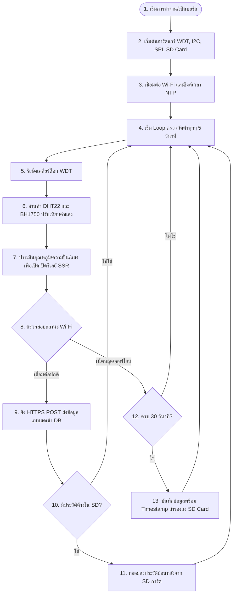

# คู่มือการใช้งานและบำรุงรักษาระบบโรงเรือนอัจฉริยะ (Greenhouse Smart IoT System Manual)

คู่มือฉบับนี้จัดทำขึ้นเพื่อใช้เป็นแนวทางมาตรฐานในการใช้งาน ติดตั้ง บำรุงรักษา และพัฒนาต่อยอดระบบควบคุมสภาพแวดล้อมในโรงเรือนอัจฉริยะ (Pangda Greenhouse) โดยมีโครงสร้างข้อมูลตามรูปแบบมาตรฐานคู่มือการปฏิบัติงาน 6 ส่วนหลัก ดังนี้:

---

## ส่วนที่ 1: บทนำและวัตถุประสงค์ (Introduction & Objectives)

### 1.1 บทนำ
ระบบโรงเรือนอัจฉริยะนี้ เป็นโซลูชันด้านอินเทอร์เน็ตของสรรพสิ่ง (IoT) ที่รวมความสามารถในการตรวจวัดค่าสภาพแวดล้อมทางฟิสิกส์ (อุณหภูมิ, ความชื้นสัมพัทธ์, ความเข้มแสง, และความเข้มแสงพืช PPFD) เข้ากับการควบคุมสวิตช์รีเลย์อัตโนมัติ (เช่น ระบบพัดลมระบายอากาศ, ระบบพ่นหมอกเพิ่มความชื้น, และระบบโคมไฟเสริมปลูกพืช) เพื่อรักษาเสถียรภาพสภาพอากาศให้เหมาะสมกับการเจริญเติบโตของพืชมากที่สุด

### 1.2 วัตถุประสงค์ของคู่มือ
1.  เพื่อให้ผู้ดูแลโรงเรือนสามารถตรวจสอบ ติดตั้ง และดูแลรักษาระบบด้วยกลไกอัตโนมัติได้อย่างถูกต้อง
2.  เพื่อเป็นแนวทางมาตรฐานในการบำรุงรักษาอุปกรณ์ฮาร์ดแวร์ให้อายุการใช้งานยาวนาน 1 ปี++
3.  เพื่ออธิบายสถาปัตยกรรมซอฟต์แวร์และโครงสร้างโค้ดอย่างละเอียด แก่นักพัฒนาที่ต้องการแก้ไขเกณฑ์การทำงาน (Thresholds) หรือต่อยอดเพิ่มอุปกรณ์ในอนาคต

---

## ส่วนที่ 2: คำอธิบายคำศัพท์เฉพาะทาง (Glossary)

*   **ESP32:** บอร์ดไมโครคอนโทรลเลอร์หลักที่ทำหน้าที่ประมวลผล สื่อสารผ่าน Wi-Fi และสั่งการขารับส่งสัญญาณดิจิทัล/อนาล็อก
*   **DHT22 (AM2302):** เซ็นเซอร์ดิจิทัลสำหรับตรวจวัดอุณหภูมิและความชื้นสัมพัทธ์ในอากาศ
*   **BH1750:** เซ็นเซอร์ดิจิทัลสำหรับวัดระดับความเข้มแสงสว่าง (หน่วย: Lux) สื่อสารผ่านบัส I2C
*   **PPFD (Photosynthetic Photon Flux Density):** ความเข้มฟลักซ์โฟตอนที่พืชนำไปใช้ในการสังเคราะห์แสงได้จริง (หน่วย: $\mu mol/m^2/s$)
*   **Solid State Relay (SSR):** รีเลย์แบบอิเล็กทรอนิกส์ ไม่มีชิ้นส่วนกลไกเคลื่อนไหว ทำให้ตัดต่อวงจรได้เงียบ ปราศจากประกายไฟ และมีอายุการใช้งานยาวนานกว่ารีเลย์แบบกลไก (Mechanical Relay)
*   **I2C (Inter-Integrated Circuit):** โปรโตคอลการสื่อสารแบบอนุกรมโดยใช้สายสัญญาณ 2 เส้น (SDA, SCL) สำหรับเชื่อมต่อบอร์ดกับ BH1750
*   **SPI (Serial Peripheral Interface):** โปรโตคอลการสื่อสารแบบอนุกรมความเร็วสูง ใช้สายสัญญาณ 4 เส้นหลัก สำหรับเชื่อมต่อโมดูล SD Card Reader
*   **Watchdog Timer (WDT):** วงจรจับเวลาป้องกันระบบค้าง หากโปรแกรมหลักติดล็อกทำงานผิดพลาดเกินเวลาที่กำหนด WDT จะสั่งฮาร์ดแวร์รีสตาร์ทตัวเองทันที
*   **Brownout Detector:** วงจรตรวจจับระดับแรงดันไฟเลี้ยง หากแรงดันไฟฟ้าตกลงต่ำกว่าระดับที่ปลอดภัยชั่วขณะ บอร์ดจะรีเซ็ตตัวเองเพื่อป้องกันชิปทำงานผิดพลาดหรือข้อมูลเสียหาย
*   **Clock Drift:** ปรากฏการณ์ที่นาฬิกาภายในบอร์ดทำงานคลาดเคลื่อนทีละเล็กน้อยเมื่อเวลาผ่านไป (แก้ปัญหาโดยซิงค์เวลาจากอินเทอร์เน็ตผ่าน NTP ทุก ๆ 24 ชั่วโมง)

---

## ส่วนที่ 3: ขั้นตอนการปฏิบัติงานและเวิร์กโฟลว์ (Work Flow & Procedures)

### 3.1 แผนผังกระบวนการทำงานหลัก (Operational Workflow)
ขั้นตอนการทำงานของอุปกรณ์จะทำงานวนลูปทุก ๆ 5 วินาที ตามโฟลว์ดังนี้:



---

### 3.2 ขั้นตอนการติดตั้งและเริ่มระบบครั้งแรก (Initial Setup Procedure)
1.  **การติดตั้งฮาร์ดแวร์ (Hardware Assembly):**
    *   เชื่อมต่ออุปกรณ์เซ็นเซอร์และรีเลย์เข้ากับพิน ESP32 ตามโครงสร้างจริงของระบบนี้:
        *   **DHT22 (อุณหภูมิ/ความชื้น):** ข้อมูลเชื่อมต่อกับขา **GPIO 4**
        *   **BH1750 (ระดับแสง):** เชื่อมต่อสัญญาณ I2C ขา **GPIO 21 (SDA)** และ **GPIO 22 (SCL)** (Address เริ่มต้น: `0x23` หรือ `0x5C`)
        *   **SD Card Reader (SPI):** เชื่อมกับขาเลือกสัญญาณ CS เข้ากับพิน **GPIO 5**
        *   **Solid State Relay (SSR) ทั้ง 3 แชนเนล:**
            *   แชนเนล 1 (ระบบระบายความร้อน พัดลม/ปั๊มน้ำ): ควบคุมโดยขา **GPIO 12**
            *   แชนเนล 2 (ระบบพ่นหมอกเพิ่มความชื้น): ควบคุมโดยขา **GPIO 13**
            *   แชนเนล 3 (ระบบไฟช่วยปลูก Grow Light): ควบคุมโดยขา **GPIO 14**
2.  **การเตรียม SD Card (SD Card Preparation):**
    *   นำ Micro SD Card (แนะนำขนาด 8GB - 32GB) ต่อเข้าคอมพิวเตอร์ ฟอร์แมตระบบไฟล์เป็น **FAT32**
    *   เสียบการ์ดเข้าช่องอ่าน Micro SD Module ให้แน่นหนาก่อนเปิดเครื่องจ่ายไฟเลี้ยงบอร์ด
3.  **การตรวจสอบคอนฟิกและเขียนโปรแกรม (Firmware Configuration & Upload):**
    *   เปิดไฟล์เฟิร์มแวร์จริงของระบบนี้ที่ [esp32_sensor_sd.ino](file:///c:/Users/June/Desktop/PangdaGreenhouse/farm-dashboard/firmware/esp32_sensor_sd/esp32_sensor_sd.ino) บน Arduino IDE หรือ VS Code
    *   ตรวจสอบตัวแปรคอนฟิกจริงที่ฝังไว้ในระบบ (ต้องตรงกับระบบที่หน้างาน):
        *   **Wi-Fi SSID:** `const char* ssid = "RPFWIFI";`
        *   **Wi-Fi Password:** `const char* password = "royalproject";`
        *   **Backend Report URL:** `const char* reportUrl = "https://pangdagreenhouse.onrender.com/api/sensors/report";`
        *   **โซนติดตั้งโรงเรือน:** `const int zoneId = 5;` *(สำหรับโซน A พื้นที่โรงเรือนบนขวา)*
    *   กดปุ่ม Upload เพื่อแฟลชซอฟต์แวร์ลงบนชิป ESP32
4.  **การตรวจสอบความสำเร็จในการบูท (Boot Verification):**
    *   เปิด Serial Monitor ปรับ Baud rate ไปที่ **`115200`**
    *   สังเกตผลการเริ่มงานระบบจริงบนหน้าจอ Monitor ซึ่งต้องขึ้นข้อความตามลำดับดังนี้:
        1.  `💾 กำลังติดตั้ง SD Card...สำเร็จ!` (หากล้มเหลวให้เช็คระบบไฟล์และการต่อขา CS 5)
        2.  `🐕 เริ่มต้นตั้งค่า Watchdog Timer...` -> `🐕 Watchdog Timer ทำงานสำเร็จ!`
        3.  `🔌 [I2C] ตั้งค่า Wire Timeout (setWireTimeout) สำเร็จ` (BH1750 ติดตั้งสำเร็จ)
        4.  `🔌 [SSR] ติดตั้งและปิดสถานะรีเลย์เริ่มต้นสำเร็จ (HIGH)`
        5.  `🌐 กำลังเชื่อมต่อ Wi-Fi: RPFWIFI ...` -> `✅ เชื่อมต่อ Wi-Fi สำเร็จ!`
        6.  `🕒 ซิงค์เวลาจาก NTP Server...` -> `✅ ซิงค์เวลากับดาวเทียมสำเร็จ!` และแจ้งเวลาเครื่องปัจจุบัน (เช่น `เวลาปัจจุบันบนบอร์ด: 2026-07-12 21:04:30`)

---

### 3.3 ขั้นตอนการบำรุงรักษาและการเฝ้าระวังระบบอัตโนมัติ (Automated Monitoring & Maintenance Workflow)
ระบบนี้ได้รับการออกแบบให้ทำงานแบบอัตโนมัติ (Unattended System) โดยไม่จำเป็นต้องมีผู้ดูแลเข้ามาตรวจสอบหน้างานหรือหน้าเว็บแดชบอร์ดทุกวัน โดยใช้กลไกการเฝ้าระวังและบำรุงรักษาดังนี้:

1.  **การเฝ้าระวังผ่านระบบแจ้งเตือนเชิงรุก (Proactive Alerting):**
    *   **การทำงาน:** เมื่อสภาวะแวดล้อมในโรงเรือน (อุณหภูมิ, ความชื้น, VPD, หรือ PPFD) ผิดปกติเกินเกณฑ์ที่กำหนดสะสมต่อเนื่องครบตามเวลา (ค่าเริ่มต้น: 30 นาที) ระบบ Backend จะทำการส่งข้อความแจ้งเตือนพร้อมคำแนะนำโดยละเอียดเข้าสู่ **Discord Webhook** ไปยังห้องแชทของเจ้าหน้าที่ผู้ดูแลทันที
    *   **การตั้งค่าสำหรับการเปิดใช้งาน:** ตรวจสอบให้มั่นใจว่าไฟล์ `.env` ของระบบ Backend มีการตั้งค่าตัวแปร `DISCORD_WEBHOOK_URL` และ `DISCORD_MENTION=@everyone` หรือระบุ ID สมาชิกที่ต้องการแจ้งเตือนอย่างถูกต้อง
    *   **แนวทางปฏิบัติสำหรับผู้ใช้:** ผู้ใช้เพียงแค่เปิดการแจ้งเตือนแอป Discord บนมือถือไว้ หากไม่มีข้อความแจ้งเตือนเข้ามา ก็แสดงว่าระบบและสภาพอากาศในโรงเรือนอยู่ในสภาวะปกติ ไม่จำเป็นต้องเข้ามาตรวจสอบหน้างานหรือเปิดแดชบอร์ดประจำวัน

2.  **การจัดการข้อมูลสำรองและการเชื่อมต่ออินเทอร์เน็ตอัตโนมัติ (Self-Recovery & Backup):**
    *   **บันทึกเมื่อออฟไลน์:** หากระบบอินเทอร์เน็ตในโรงเรือนหลุด บอร์ด ESP32 จะทำการเขียนบันทึกข้อมูลสภาพอากาศสำรองลง Micro SD Card เป็นไฟล์ CSV โดยอัตโนมัติ (จะสังเกตเห็นไฟสถานะของโมดูล SD Card กะพริบทุก ๆ 30 วินาที)
    *   **กู้คืนข้อมูลอัตโนมัติเมื่อออนไลน์:** เมื่อการเชื่อมต่ออินเทอร์เน็ตกลับมาเป็นปกติ บอร์ดจะอ่านข้อมูลที่ยังไม่ได้ส่งจาก SD Card และทยอยอัปโหลดกลับขึ้นฐานข้อมูล (Cloud Database) ให้โดยอัตโนมัติ โดยที่ผู้ดูแลไม่ต้องมาตั้งค่าหรือทำการกดกู้คืนด้วยตนเอง

3.  **การตรวจเช็คสภาพทางกายภาพตามรอบสัปดาห์ (Weekly Physical Check):**
    *   เนื่องจากระบบไม่จำเป็นต้องเช็ครายวัน ผู้ดูแลหรือวิศวกรโรงเรือนควรเข้าตรวจสอบกล่องควบคุมและอุปกรณ์เซ็นเซอร์หน้างานสัปดาห์ละ 1 ครั้ง โดยกรอกข้อมูลและตรวจสอบตามหัวข้อใน **"ส่วนที่ 5.3: ใบเช็คลิสต์ตรวจสภาพบำรุงรักษาประจำสัปดาห์"** เพื่อป้องกันความเสียหายจากฝุ่น น้ำ หรือความร้อนสะสมในระยะยาว

---

## ส่วนที่ 4: แผนภาพและภาพประกอบระบบ (Illustrations & Diagrams)

### 4.1 แผนผังการต่อวงจรพินควบคุม (Hardware Wiring Pinout)
ในการติดตั้งหรือเปลี่ยนอุปกรณ์เซ็นเซอร์ ให้เชื่อมสายไฟตามพินพอยต์ดังตารางนี้:

```
        +-----------------------------------+
        |            ESP32 BOARD            |
        |                                   |
        | 3.3V  GND  D4  D21  D22  D19  D23 | ...
        +--+-----+----+---+----+----+----+--+
           |     |    |   |    |    |    |
   +-------+     |    |   |    |    |    |
   |   +---------+    |   |    |    |    |
   |   |              |   |    |    |    |
 [VCC GND DATA]     [VCC GND SDA SCL]   [MISO MOSI SCK CS VCC GND]
    DHT22             BH1750 LIGHT            SD CARD READER
 (GPIO 4)             (GPIO 21/22)               (SPI Pins)
```

---

### 4.2 ภาพตัวอย่างการแสดงผลหน้าแดชบอร์ด (Greenhouse Dashboard Interface)
ภาพจำลองการออกแบบส่วนติดต่อประสานผู้ใช้ (User Interface) ของหน้าเว็บฟาร์มแดชบอร์ด แสดงค่าอุณหภูมิ ความชื้น แสง และความเข้มแสงพืช (PPFD) พร้อมกราฟแสดงแนวโน้มแบบเรียลไทม์:


---

## ส่วนที่ 5: แบบฟอร์มและเอกสารอ้างอิง (Forms & References)

### 5.1 โครงสร้างไฟล์บันทึกออฟไลน์ใน SD Card (Offline Log CSV Schema)
ข้อมูลในไฟล์ `/offline_logs.csv` จะถูกบันทึกคั่นด้วยเครื่องหมายคอมมา (,) โดยมีโครงสร้างดังนี้:

| ลำดับฟิลด์ | ชื่อตัวแปร | รูปแบบข้อมูล (Format) | ตัวอย่างข้อมูล | คำอธิบาย |
| :--- | :--- | :--- | :--- | :--- |
| 1 | Timestamp | ISO 8601 String | `2026-07-12T21:04:30+07:00` | วันเวลาท้องถิ่นเขตเวลาไทย หรือเวลา Uptime สำรอง |
| 2 | Temperature | Float (ทศนิยม 2 ตำแหน่ง)| `28.50` | ค่าอุณหภูมิอากาศ (°C) |
| 3 | Humidity | Float (ทศนิยม 2 ตำแหน่ง)| `65.20` | ค่าความชื้นสัมพัทธ์ในอากาศ (%) |
| 4 | Lux | Integer | `15200` | ระดับความสว่างของแสงสว่าง (Lux) |
| 5 | Zone ID | Integer | `5` | หมายเลขประจำโซนของโรงเรือน (1-5) |

*ตัวอย่างบันทึกในไฟล์:*
```csv
2026-07-12T21:04:30+07:00,28.50,65.20,15200,5
2026-07-12T21:05:00+07:00,28.40,65.80,15150,5
```

---

### 5.2 แหล่งอ้างอิงโค้ดและไฟล์ในโปรเจกต์ (Project References)
*   **ไฟล์รวมสำหรับอัปโหลดขึ้น Google Drive (ZIP Archive):** [project_references_drive.zip](file:///c:/Users/June/Desktop/PangdaGreenhouse/farm-dashboard/project_references_drive.zip) *(ไฟล์นี้รวบรวมโค้ดและเอกสารอ้างอิงหลักทั้งหมดไว้ในไฟล์เดียว เพื่อความสะดวกในการดาวน์โหลดหรืออัปโหลดขึ้นคลาวด์)*
*   **โฟลเดอร์รวบรวมไฟล์อ้างอิง:** [project_references_drive/](file:///c:/Users/June/Desktop/PangdaGreenhouse/farm-dashboard/project_references_drive)
    *   **ไฟล์เฟิร์มแวร์อุปกรณ์ (ESP32 Firmware):** [esp32_sensor_sd.ino](file:///c:/Users/June/Desktop/PangdaGreenhouse/farm-dashboard/project_references_drive/esp32_sensor_sd.ino)
    *   **เอกสารสมการการวิเคราะห์ข้อมูลแสง (Formulas Report):** [greenhouse_formulas_report.md](file:///c:/Users/June/Desktop/PangdaGreenhouse/farm-dashboard/project_references_drive/greenhouse_formulas_report.md)
    *   **เอกสารอธิบายหลักการทำงานอย่างละเอียด (Working Principle):** [greenhouse_working_principle.md](file:///c:/Users/June/Desktop/PangdaGreenhouse/farm-dashboard/project_references_drive/greenhouse_working_principle.md)
    *   **โค้ดจำลองการอัปโหลดข้อมูล (Simulator Script):** [simulate_esp32_sd.ts](file:///c:/Users/June/Desktop/PangdaGreenhouse/farm-dashboard/project_references_drive/simulate_esp32_sd.ts)
    *   **โค้ดส่วนติดต่อ API ของฝั่งเว็บไซต์ (Backend Controller):** [sensor.controller.ts](file:///c:/Users/June/Desktop/PangdaGreenhouse/farm-dashboard/project_references_drive/sensor.controller.ts)

---

### 5.3 ใบเช็คลิสต์ตรวจสภาพบำรุงรักษาประจำสัปดาห์ (Weekly Checklist Form)
*(ผู้ดูแลระบบหรือวิศวกรโรงเรือนควรพิมพ์แบบฟอร์มนี้เพื่อลงบันทึกการตรวจสอบทุกสัปดาห์)*

| จุดตรวจสอบ | รายละเอียดความเรียบร้อยที่ต้องผ่านเกณฑ์ | สถานะ (ผ่าน/ไม่ผ่าน) | หมายเหตุ / จุดที่ต้องแก้ไข |
| :--- | :--- | :---: | :--- |
| **1. ระบบจ่ายไฟ** | ระดับแรงดันไฟเลี้ยงที่จุด ESP32 นิ่งคงที่ (ไม่กะพริบหรือสั่นไหวรุนแรง) | [ ] Pass  [ ] Fail | |
| **2. ตัวรับสัญญาณ** | สายเชื่อมต่อเซ็นเซอร์ DHT22 และ BH1750 แน่นหนา ไม่เกิดการกัดกร่อนจากออกไซด์ | [ ] Pass  [ ] Fail | |
| **3. เลนส์ BH1750** | ผิวหน้าโดมแก้ว BH1750 ใสสะอาด ปราศจากคราบฝุ่น คราบน้ำ หรือใยแมงมุม | [ ] Pass  [ ] Fail | |
| **4. SD Card Reader** | การ์ดเสียบแน่นหนา สามารถถอดและเสียบใหม่และอ่านไฟล์ได้ปกติ | [ ] Pass  [ ] Fail | |
| **5. รีเลย์ควบคุม SSR** | หน้าสัมผัสตัดต่อไฟไม่มีรอยความร้อนสะสม หรือเสียงสปาร์คทางไฟฟ้า | [ ] Pass  [ ] Fail | |
| **6. สัญญาณ Wi-Fi** | บอร์ดเกาะเราเตอร์โรงเรือนได้เสถียร มีระดับสัญญาณ (RSSI) ที่น่าพึงพอใจ | [ ] Pass  [ ] Fail | |

---

## ส่วนที่ 6: การแก้ไขปัญหาเบื้องต้น (Troubleshooting)

เมื่อระบบเกิดข้อขัดข้องขึ้น ให้ตรวจสอบและแก้ไขตามคู่มือตรวจอาการเบื้องต้นนี้:

| อาการขัดข้อง | สาเหตุที่เป็นไปได้ | ขั้นตอนการแก้ไขทีละขั้น (Step-by-Step) |
| :--- | :--- | :--- |
| **บอร์ดวนลูฟรีเซ็ตตัวเองทุก ๆ 15 วินาที** | 1. เกิดสภาวะไฟตกชั่วขณะจากการเปิดพัดลม/ปั๊มน้ำ (Brownout)<br>2. เกิดการค้างในกระบวนการทำงานและถูกบีบให้ดับด้วย Watchdog | 1. ให้เช็คว่าอแดปเตอร์จ่ายไฟมีขนาดกำลังขับ 5V 2A ขึ้นไปหรือไม่<br>2. ทดสอบนำ Capacitor ขนาด 1000uF มาคร่อมพิน 5V และ GND<br>3. ถอด SD Card ออกมาลบไฟล์ CSV ที่อาจบวมโตเกินขนาดออกแล้วเสียบกลับเข้าใหม่ |
| **ค่าแสง Lux ที่อ่านได้ค้างอยู่ที่ 0 หรือแสดงค่าเออเรอร์** | 1. สายขั้ว I2C (SDA/SCL) สลับพิน หรือสายสัญญาณหลุดหลวม<br>2. ชิป BH1750 ค้างจากสัญญาณไฟฟ้ารบกวน | 1. ตรวจสายพิน 21 และ 22 ว่าสลับกันหรือไม่<br>2. ปิดสวิตช์เครื่อง ปล่อยกระแสไฟเลี้ยงออกให้หมด 10 วินาทีแล้วเปิดใหม่ เพื่อรีเซ็ตวงจรชิปเซ็นเซอร์<br>3. เพิ่มสายชีลด์ป้องกันการกวนสัญญาณ หรือย้ายสาย I2C ให้ห่างจากสายไฟของรีเลย์ |
| **ค่าอุณหภูมิ/ความชื้นแสดงเป็น nan (Not a Number)** | 1. สาย DATA ของ DHT22 ขาดหรือสัมผัสไม่สนิท<br>2. ตัวต้านทาน Pull-up บนบอร์ดตัวรับขาดหาย | 1. ขยับขั้วเสียบสาย GPIO 4 ใหม่ให้แน่นหนา<br>2. หากต่อสายยาวเกิน 2 เมตร ให้ต่อตัวต้านทาน 10kΩ คร่อมพิน DATA กับ VCC เพื่อช่วยประคองสัญญาณสัญญาณ |
| **หน้าเว็บไม่แสดงข้อมูลล่าสุด (แต่บอร์ดรันปกติ)** | 1. บอร์ดต่อ Wi-Fi ไม่สำเร็จ<br>2. API URL ปลายทางผิด หรือเซิร์ฟเวอร์ Backend ออฟไลน์ | 1. ตรวจสอบว่าสัญญาณไวไฟของโรงเรือนล่มหรือไม่<br>2. เปิด Serial Monitor เช็ครหัสตอบกลับของเซิร์ฟเวอร์ (เช่น ส่งไม่ผ่าน รหัส 404 หรือ 500) เพื่อแจ้งผู้พัฒนาเว็บแก้จุดรับข้อมูล |
| **SD Card Mount Failed (การ์ดล้มเหลว)** | 1. SD Card เสียฟอร์แมตผิดระบบ<br>2. หน้าสัมผัสของพิน SPI สกปรก | 1. นำ SD Card เสียบคอมพิวเตอร์และล้างข้อมูลใหม่โดยเลือกประเภทระบบไฟล์เป็น **FAT32** เท่านั้น (ห้ามเลือก exFAT/NTFS)<br>2. ตรวจสอบพินต่อโมดูล SD Reader ขา CS (Pin 5), SCK (Pin 18), MOSI (Pin 23), MISO (Pin 19) |
