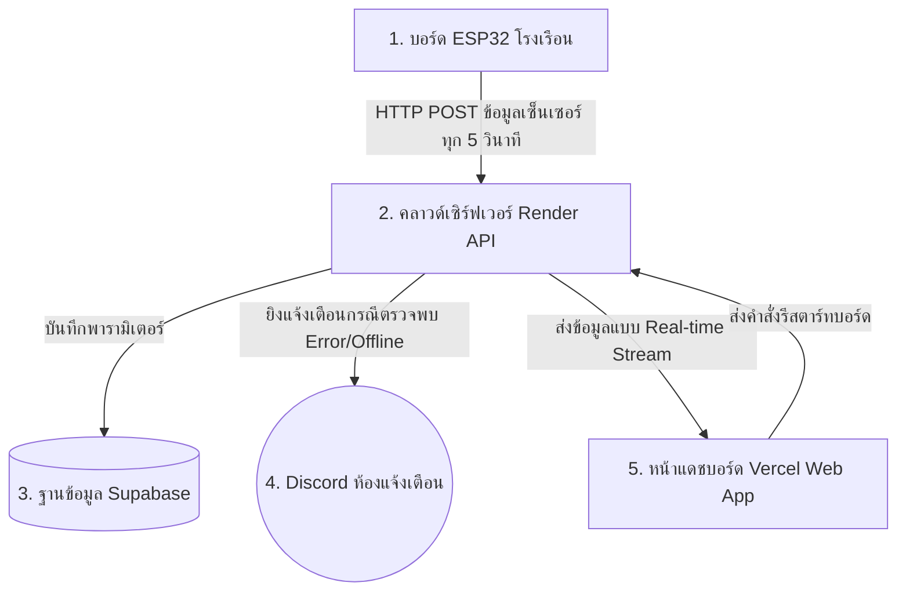

# คู่มือการปฏิบัติงานระบบควบคุมโรงเรือนพังดา (Pangda Greenhouse Work Manual)

คู่มือนี้เป็นเอกสารมาตรฐานการปฏิบัติงาน (Standard Operating Procedure - SOP) เพื่อการตรวจสอบ ควบคุม และบำรุงรักษาระบบควบคุมสภาวะแวดล้อมโรงเรือนเพาะพันธุ์ไม้ผลพังดา ทั้งในฝั่งระบบแสดงผล (Dashboard) และฝั่งฮาร์ดแวร์ตรวจวัด (ESP32 IoT Node)

---

## 1. บทนำและวัตถุประสงค์ (Introduction & Objective)
* **ภาพรวมระบบ:** ระบบควบคุมโรงเรือนพังดาประกอบด้วยบอร์ดไมโครคอนโทรลเลอร์ ESP32 สำหรับตรวจวัดสภาพแวดล้อมและส่งข้อมูลผ่าน Wi-Fi ขึ้นระบบคลาวด์ พร้อมแสดงผลข้อมูลอุณหภูมิ ความชื้น VPD และค่าความเข้มแสงแดดแบบเรียลไทม์ผ่านแดชบอร์ดหน้าเว็บ รวมถึงจัดส่งรายงานภัยพิบัติหรือสภาพแวดล้อมวิกฤตผ่าน Discord Webhook
* **วัตถุประสงค์คู่มือ:** เพื่อเป็นแนวทางสำหรับเจ้าหน้าที่และผู้ควบคุมโรงเรือนในการประเมินความเหมาะสมของสภาพอากาศต่อสรีรวิทยาของไม้ผล ตลอดจนให้ขั้นตอนบำรุงรักษาฮาร์ดแวร์เพื่อความเสถียรและความแม่นยำตลอด 24 ชั่วโมง
* **กลุ่มผู้ใช้งาน:** เจ้าหน้าที่ผู้ดูแลโรงเรือนเพาะพันธุ์พืช, นักส่งเสริมการเกษตร และช่างบำรุงรักษาระบบเทคโนโลยีสารสนเทศ

---

## 2. คำอธิบายคำศัพท์ (Glossary)
* **อุณหภูมิอากาศ (Air Temperature):** ระดับความร้อนเย็นของมวลอากาศในโรงเรือน ส่งผลต่อความชื้นสัมพัทธ์และการเปิดปากใบของพืช (หน่วยวัด: °C)
* **ความชื้นสัมพัทธ์ (Relative Humidity - %RH):** สัดส่วนปริมาณไอน้ำจริงที่มีอยู่ในอากาศเทียบกับไอน้ำสูงสุดที่อุ้มได้ บ่งชี้ความอิ่มตัวของน้ำในอากาศ (หน่วยวัด: %RH)
* **ค่าความต่างของความดันไอน้ำ (Vapor Pressure Deficit - VPD):** ดัชนีหลักทางพฤกษศาสตร์ใช้ระบุแรงดันไอน้ำในการคายน้ำของพืช ค่า VPD ที่ดีจะช่วยกระตุ้นให้พืชดูดปุ๋ยและน้ำขึ้นจากรากได้อย่างสมบูรณ์ (หน่วยวัด: kPa)
* **ค่าความเข้มแสงสังเคราะห์ (PPFD):** ปริมาณความเข้มแสงแดดเฉพาะคลื่นความถี่ที่พืชนำไปใช้สังเคราะห์แสงสร้างอาหารได้จริงโดยตรง (หน่วยวัด: μmol/m²/s)
* **ความส่องสว่าง (Lux):** ปริมาณแสงสว่างโดยรอบตัวรับรู้ ใช้ประเมินสภาพแสงโดยภาพรวมในและนอกโรงเรือน (หน่วยวัด: Lux)
* **Watchdog Timer (WDT):** ระบบฮาร์ดแวร์สำรองทำหน้าที่ตรวจสอบการทำงานของ CPU ESP32 หากระบบเกิดการแฮงก์หรือหยุดนิ่งเกิน 15 วินาที จะตัดไฟรีสตาร์ทบอร์ดใหม่เองทันที
* **Self-Healing Reboot:** ตรรกะบนเฟิร์มแวร์ที่จะสั่งการให้บอร์ดรีบูทตัวเองหากขาดการเชื่อมต่อเครือข่าย Wi-Fi นานติดต่อกันเกิน 15 นาที
* **Solid State Relay (SSR):** รีเลย์สวิตช์อิเล็กทรอนิกส์ไร้สัมผัส ทำหน้าที่เปิด-ปิดการจ่ายไฟเลี้ยงให้อุปกรณ์ไฟฟ้าในโรงเรือนแบบปลอดภัยสูง

---

## 3. ขั้นตอนการปฏิบัติงาน (Work Flow)

### ขั้นตอนที่ 1: ตรวจเช็คสภาพสิ่งแวดล้อมประจำวันผ่านหน้าเว็บ
1. เปิดเว็บบราวเซอร์และเข้าลิงก์แดชบอร์ดหลัก: **[https://pangdagreenhouse.vercel.app](https://pangdagreenhouse.vercel.app)**
2. สังเกตค่าเฉลี่ยประเมินสิ่งแวดล้อมที่การ์ด **"ภาพรวมสภาพแวดล้อมเฉลี่ย" (Zone Averages)** ด้านบนสุด
3. ตรวจเช็คการ์ดคำแนะนำพารามิเตอร์รายโซน หากมีสถานะ **เฝ้าระวัง 🟡** หรือ **ไม่เหมาะสม 🔴** ให้ดำเนินการปรับปรุงพัดลมระบายอากาศหรือสเปรย์หมอกน้ำตามคำแนะนำกึ่งทางการที่ระบุใต้การ์ด

### ขั้นตอนที่ 2: การดาวน์โหลดข้อมูลประวัติสภาพอากาศ (Excel)
1. เลื่อนหน้าเว็บลงมาด้านล่างสุดในหัวข้อ **"ดาวน์โหลดข้อมูลโรงเรือน"**
2. เลือกโซนที่ต้องการสืบค้น (เลือกเฉพาะโซน A - E หรือเลือก "ทุกโซน")
3. คลิกช่องปฏิทินเพื่อระบุช่วงวันที่เริ่มต้น และวันสิ้นสุดที่ต้องการดึงรายงาน
4. กดปุ่ม **"ดาวน์โหลด Excel"** เพื่อรับไฟล์ข้อมูลสรุปสำหรับการนำไปใช้ประเมินผลในสเปรดชีต

### ขั้นตอนที่ 3: การสั่งการรีสตาร์ทบอร์ดควบคุมระยะไกล (Remote Reboot)
1. หากพบเหตุการณ์สัญญาณค้างนิ่งของเซ็นเซอร์ หรือบอร์ดแสดงสถานะออฟไลน์แต่ระบบอินเทอร์เน็ตยังทำงานอยู่
2. เลื่อนลงมาล่างสุดที่หัวข้อ **"จัดการอุปกรณ์บอร์ด ESP32"**
3. กดปุ่ม **"รีสตาร์ทบอร์ด (Restart ESP32)"**
4. หน้าจอจะแสดงหน้าต่างยืนยันความปลอดภัย (`window.confirm`) เพื่อป้องกันการเผลอกด ให้กดยืนยันคำขอส่งสัญญาณรีบูทไปยังอุปกรณ์

---

## 4. ภาพประกอบหรือแผนภาพ (Diagrams & UI Layout)

### แผนภาพการเชื่อมโยงระบบเครือข่ายและการไหลของข้อมูล (Data Flow Diagram)

### การจัดวางเลย์เอาต์หน้าจอหลัก (Dashboard Layout Map)
1. **Header Section:** บ่งบอกเวลาปัจจุบัน สถานะออนไลน์ของอุปกรณ์รวม และสวิตช์สลับโหมดกลางวัน/กลางคืน
2. **Zone Averages Block:** ภาพรวมดัชนีคุณภาพและคำอธิบายสรีรวิทยาของพืชรายวัน
3. **Climate Control Selector:** แผงควบคุมจับคู่โซนแผนผังโรงเรือนเพื่อเรียกดูพิกัด
4. **Climate Cards:** การ์ดสีแสดงอุณหภูมิ ความชื้น VPD ความเข้มแสงแดด พร้อมกราฟขนาดเล็กและแถบคำแนะนำกึ่งทางการ
5. **Comparison Chart:** กราฟวิเคราะห์เปรียบเทียบแนวโน้มข้ามโซนย้อนหลัง 24 ชั่วโมงแบบละเอียด
6. **Data Downloader:** กล่องระบุโซนและเลือกปฏิทินเพื่อดาวน์โหลดไฟล์รายงาน Excel
7. **ESP32 Controller Panel:** ปุ่มขนาดเล็กสีแดงพร้อมป๊อปอัปยืนยัน สำหรับกดสั่งรีบูทบอร์ดจากระยะไกล

---

## 5. แบบฟอร์มและเอกสารอ้างอิง (Forms & References)

### เกณฑ์วิเคราะห์ความเหมาะสมสภาพภูมิอากาศสำหรับพืชไม้ผล (Reference Thresholds)
* **เกณฑ์อุณหภูมิอากาศ (°C):**
  * เหมาะสมมาก: `25.0 — 30.0 °C`
  * เฝ้าระวัง: `20.0 — 21.9 °C` หรือ `32.1 — 35.0 °C`
* **เกณฑ์ความชื้นสัมพัทธ์ (%RH):**
  * เหมาะสมมาก: `60.0 — 80.0 %RH`
  * เฝ้าระวัง: `40.0 — 49.9 %RH` หรือ `85.1 — 90.0 %RH`
* **เกณฑ์ความต่างแรงดันไอน้ำ (VPD - kPa):**
  * เหมาะสมมาก: `0.40 — 0.80 kPa`
  * เฝ้าระวัง: `0.20 — 0.29 kPa` หรือ `1.21 — 1.60 kPa`
* **เกณฑ์ความเข้มแสงแดด (PPFD - μmol/m²/s):**
  * เหมาะสมมาก: `400.0 — 800.0 μmol/m²/s`
  * เฝ้าระวัง: `200.0 — 299.9 μmol/m²/s` หรือ `950.1 — 1100.0 μmol/m²/s`

---

## 6. การแก้ไขปัญหาเบื้องต้น (Troubleshooting)

| อาการขัดข้อง | สาเหตุที่เป็นไปได้ | ขั้นตอนการแก้ไขเบื้องต้น |
| :--- | :--- | :--- |
| **1. หน้าเว็บแสดง "🔴 Sensor Offline" เกิน 10 นาที** | • สัญญาณอินเทอร์เน็ตเราเตอร์ Wi-Fi ที่โรงเรือนหลุด • ไฟดับในโรงเรือนหรือปลั๊กจ่ายไฟ ESP32 หลุดหลวม | 1. ตรวจเช็คว่าเราเตอร์ Wi-Fi ปล่อยสัญญาณอินเทอร์เน็ตได้ปกติหรือไม่ 2. หากระบบสัญญาณกลับมาดีแล้ว บอร์ดจะทำการตรวจเช็คตัวเองและต่อเชื่อมสายใหม่อัตโนมัติ (Self-Healing) ใน 15 นาที หรือกดปุ่มสั่งการรีสตาร์ทหน้าเว็บคอนโซลด้านล่างสุด |
| **2. ได้รับแจ้งเตือน "Hardware Error" หรือมีค่าลบ (-99) หรือ NaN** | • สายต่อสัญญาณของเซนเซอร์หลุดชำรุด • คอนแทกต์โลหะขึ้นสนิมเขียวหรือมีความชื้นสัมผัสชื้นสะสมสูงเกินไป | 1. ปิดสวิตช์ไฟของกล่องควบคุมเพื่อความปลอดภัย 2. ตรวจเช็คความแน่นหนาของขั้วต่อสัญญาณเซนเซอร์ DHT22/SHT31 และใช้เครื่องเป่าลมไล่ความชื้นหากพบน้ำเกาะ |
| **3. บอร์ด ESP32 มีความร้อนสะสมสูงกว่าปกติ** | • แรงดันแหล่งจ่ายไฟหลักสูงเกินไป (จ่ายตรง 9V-12V เข้า Vin) • ใช้งานดึงไฟ 3.3V เลี้ยง SD Card และ Relay จากตัวบอร์ดโดยตรง | 1. เปลี่ยนอะแดปเตอร์แปลงไฟมาใช้ระดับ 5V เลี้ยงบอร์ดทางช่อง USB หรือช่องพิน 5V เท่านั้น 2. ทำการแยกแหล่งจ่ายไฟ 5V นอกจ่ายเลี้ยง SD Card และบอร์ดรีเลย์โดยตรง (แชร์ Ground ร่วมกัน) 3. ปรับค่าตัวแปรการอ่านข้อมูล `readInterval` ท้ายโค้ดเฟิร์มแวร์เป็น 30 วินาที เพื่อให้โมดูล Wi-Fi ได้พักการส่ง |
